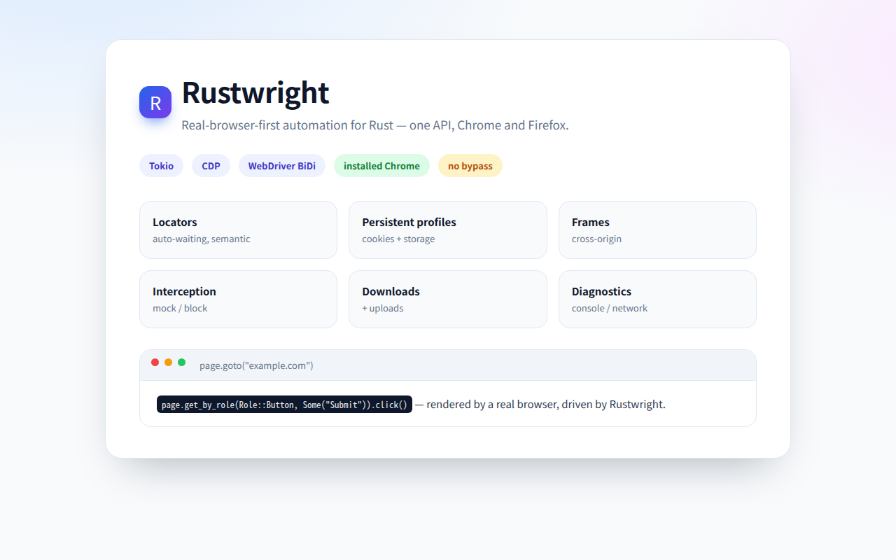
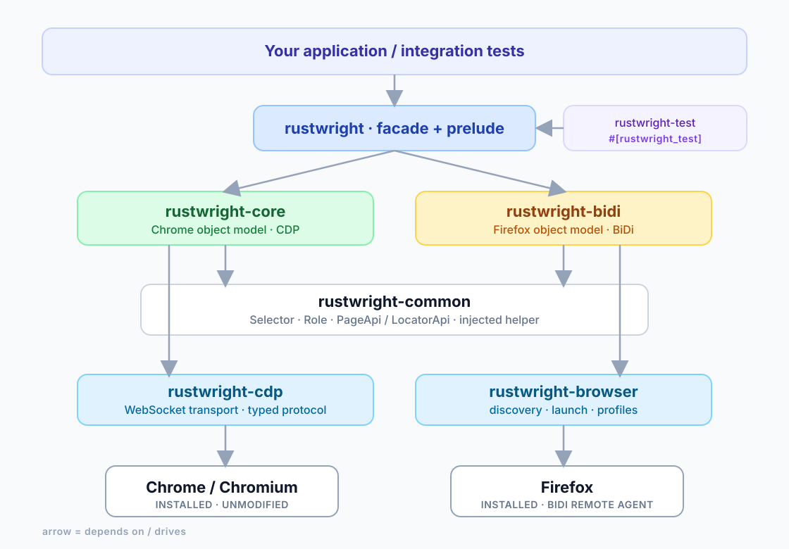
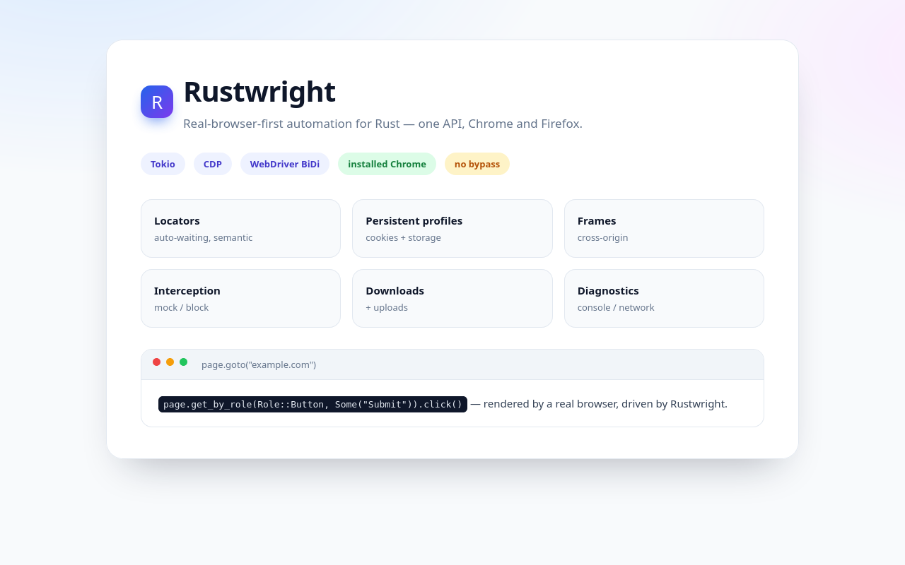

<p align="center">
  
</p>

<p align="center">
  <a href="#quick-start"></a>
  
  
  
  
  <a href="https://github.com/rsasaki0109/rustwright/actions/workflows/ci.yml"></a>
</p>

<p align="center">
  <b>Real-browser-first browser automation for Rust.</b><br>
  Drives the Chrome or Firefox already installed on your machine — one Playwright-like async API, two real-browser transports.
</p>

<p align="center">
  
</p>

Rustwright is not a Playwright binding and not an anti-bot framework. It minimizes
the difference between automated and normal browsing by driving a standard,
unmodified browser and by making any remaining difference observable.

```rust
use rustwright::prelude::*;

#[tokio::main]
async fn main() -> Result<()> {
    let browser = Browser::launch(
        Chrome::installed().headless(false)
    ).await?;
    let page = browser.new_page().await?;
    page.goto("example.com").await?;
    println!("{}", page.title().await?);
    browser.close().await?;
    Ok(())
}
```

## Contents

- [Why Rustwright](#why-rustwright)
- [Architecture](#architecture)
- [Quick start](#quick-start)
- [API sketch](#api-sketch)
- [One API, two backends](#one-api-two-backends)
- [Firefox and WebDriver BiDi](#firefox-and-webdriver-bidi)
- [Testing](#testing)
- [Performance](#performance)
- [Compatibility](#compatibility)
- [Browser discovery](#browser-discovery)
- [Status](#status)
- [Non-goals](#non-goals)
- [Development](#development)

## Why Rustwright

- **Rust-native implementation**, `async`/`await` on Tokio. No Node, no driver.
- **Installed browsers first** — no bundled or patched browser.
- **Persistent profiles** so cookies, `localStorage`, `sessionStorage` and logins
  survive between runs.
- **Connect to a browser you already have open** via `Browser::connect`.
- **Playwright-like `Browser` / `BrowserContext` / `Page` / `Locator` model.**
- **Event-driven waiting** — no fixed sleeps in the public API.
- **Diagnostics** — console messages, JS errors, network requests, dialogs,
  browser version, executable path and launch flags are all observable.

## Architecture

<p align="center">
  
</p>

Transport is the only thing that differs between backends: selectors, wait states
and the page-side helper are shared, and the object model is exposed through the
same `PageApi` / `LocatorApi` traits.

## Quick start

Add the dependency:

```toml
[dependencies]
rustwright = { path = "crates/rustwright" }
tokio = { version = "1", features = ["full"] }
```

Then run one of the examples:

```sh
cargo run -p rustwright-examples --example quickstart
cargo run -p rustwright-examples --example offline_smoke      # no network needed
cargo run -p rustwright-examples --example persistent_profile
cargo run -p rustwright-examples --example connect_existing
cargo run -p rustwright-examples --example bidi_firefox       # Firefox / BiDi
cargo run -p rustwright-examples --example extract_items -- \
    "https://jp.mercari.com/search?keyword=iphone" "a[href*='/item/']"
```

`extract_items` is a small *user-code* example: it loads a listing page and
reads titles, prices and links via locators/evaluate. Site-specific logic stays
in your code, never in the core.

## API sketch

```rust
// Launch, headless or headed.
let browser = Browser::launch(Chrome::installed().headless(false)).await?;

// Persistent profile.
let browser = Browser::launch(
    Chrome::installed().profile("./profile").headless(false)
).await?;

// Or attach to a running browser:
//   google-chrome --remote-debugging-port=9222 --user-data-dir=/tmp/live
let browser = Browser::connect("http://127.0.0.1:9222").await?;

// Pages and contexts.
let page = browser.new_page().await?;
let context = browser.new_context().await?;   // isolated cookies/storage

// Navigation.
page.goto("https://example.com").await?;
page.reload().await?;
println!("{}", page.url());
println!("{}", page.title().await?);
let html = page.content().await?;
page.screenshot("page.png").await?;

// Locators (lazy + auto-waiting).
let q = page.locator("input[name=q]");
q.fill("hello").await?;
q.click().await?;
println!("{}", q.text().await?);
println!("{}", q.is_visible().await?);

// Locator collections.
let items = page.locator("li.item");
println!("{}", items.count().await?);
items.first().click().await?;
items.nth(2).hover().await?;
for item in items.all().await? { println!("{}", item.text().await?); }

// Semantic locators.
page.get_by_text("Login").click().await?;
page.get_by_role(Role::Button, Some("Submit")).click().await?;
page.get_by_placeholder("Search").fill("rust").await?;
page.get_by_label("Email").fill("a@b.c").await?;
page.get_by_test_id("submit").click().await?;

// Forms and real input.
page.locator("#agree").check().await?;
page.locator("#plan").select_option("pro").await?;
page.locator("#search").press("Enter").await?;
page.mouse_wheel(400.0, 300.0, 0.0, 800.0).await?; // infinite-scroll feeds

// Waiting.
page.wait_for_load_state(LoadState::DomContentLoaded).await?;
page.wait_for_load_state(LoadState::NetworkIdle).await?;
page.wait_for_url("/dashboard").await?;
page.locator("#result").wait_for(WaitState::Visible).await?;

// Popups / new tabs, and reusable login state.
let popup = browser.default_context().wait_for_page(Duration::from_secs(10)).await?;
let state = page.storage_state().await?;       // cookies + localStorage
page.restore_storage_state(&state).await?;

// Request interception (generic; no site-specific rules).
page.mock("**/api/data", 200, "application/json", r#"{"ok":true}"#).await?;
page.block("**/ads/**").await?;
page.clear_routes().await?;

// Frames, including cross-origin iframes.
let frame = page.frame_locator("iframe").resolve().await?;
frame.get_by_placeholder("Search").fill("rust").await?;
println!("{}", frame.url());

// Uploads and downloads.
browser.default_context().set_download_path("./downloads").await?;
page.locator("input[type=file]").set_input_files(["./a.pdf"]).await?;

// A stable viewport for deterministic SPA rendering.
page.set_viewport(&Viewport::new(1280, 800)).await?;

// Chrome tracing (JSON with optional screenshots).
page.start_tracing().await?;
// ... exercise the page ...
page.stop_tracing("trace.json").await?;

// Diagnostics.
for message in page.console_messages() { println!("[{}] {}", message.level, message.text); }
for error in page.errors() { println!("error: {}", error.message); }
for dialog in page.dialogs() { println!("dialog: {}", dialog.message); }
let diag = browser.diagnostics();
println!("{:?}", diag.launch_args);
```

## One API, two backends

`PageApi` and `LocatorApi` in `rustwright-common` are implemented by both the CDP
backend (`Page` / `Locator`) and the BiDi backend (`BidiPage` / `BidiLocator`), so
generic code runs against either browser:

```rust
use rustwright::prelude::*;

async fn fill_and_read<P>(page: &P, text: &str) -> std::result::Result<String, P::Error>
where
    P: PageApi,
    P::Locator: LocatorApi<Error = P::Error>,
{
    page.goto("https://example.com").await?;
    page.locator(Selector::css("input[name=q]")).fill(text).await?;
    let value = page
        .evaluate("document.querySelector('input[name=q]').value")
        .await?;
    Ok(value.as_str().unwrap_or_default().to_string())
}
```

The traits are generic over an associated `Error`, so each backend keeps its own
precise error type and causal chain; dispatch is static (use them as bounds).
`tests/unified.rs` runs the same helpers against Chrome and Firefox.

When a single runtime-selected type is needed, `AnyPage` / `AnyLocator` wrap
either backend in an enum (with a unified `AnyError`) and implement the same
traits, so mixed backends can live in one collection:

```rust
let mut pages: Vec<AnyPage> = Vec::new();
pages.push(browser.new_page().await?.into());          // Chrome
pages.push(bidi_browser.new_page().await?.into());     // Firefox
for page in &pages {
    page.goto("example.com").await?;
    println!("[{}] {}", page.backend_name(), page.title().await?);
}
```

## Firefox and WebDriver BiDi

Chrome is driven over CDP. Firefox is driven over **WebDriver BiDi**, a separate
transport, so it lives in its own crate:

```rust
use rustwright::bidi::BidiBrowser;
use rustwright::prelude::*;

#[tokio::main]
async fn main() -> rustwright::BidiResult<()> {
    let browser = BidiBrowser::launch(Firefox::installed().headless(false)).await?;
    let page = browser.new_page().await?;
    page.goto("example.com").await?;
    println!("{}", page.title().await?);

    // The same Playwright-like locators, backed by BiDi.
    page.get_by_placeholder("Search").fill("rust").await?;
    page.get_by_role(Role::Button, Some("Go")).click().await?;
    page.get_by_text("Results").wait_for(WaitState::Visible).await?;
    page.screenshot("firefox.png").await?;

    browser.close().await?;
    Ok(())
}
```

<p align="center">
  
</p>

`rustwright-bidi` exposes the raw client too (`BidiSession`, typed
`browsingContext.*` / `script.*` helpers, and an event stream), can connect
to any BiDi endpoint with `BidiBrowser::connect`, and provides `BidiLocator`
with auto-waiting `click` / `fill` / `text` / `wait_for` / `count` and the
`get_by_*` strategies. Real pointer and key input uses `input.performActions`,
not synthetic DOM events. BiDi also mirrors the CDP backend's request
interception (`route` / `mock` / `block` / `clear_routes`, backed by
`network.addIntercept` + `network.provideResponse`), opt-in network monitoring
(`start_network_monitoring` / `network_requests`), frames (`frames` /
`frame_locator` / `BidiFrame` with frame-scoped locators), cookies / storage
(`cookies` / `add_cookie` / `clear_cookies` / `storage_state` /
`restore_storage_state`, backed by `storage.*`), and isolated user contexts
(`BidiBrowser::new_context` / `BidiContext`).

Notes from real machines:

- Firefox's remote agent is started with `--remote-debugging-port`; Rustwright
  picks a free port and connects to `ws://127.0.0.1:PORT/session`.
- Sandboxed Firefox builds (for example the Snap) cannot read arbitrary
  `--profile` paths and cannot navigate to `file://` outside their sandbox.
  `Firefox::installed()` uses the browser's own default profile, which works;
  when a custom profile is requested on a sandboxed build, Rustwright warns and
  falls back to the default profile instead of failing (`Firefox::is_sandboxed`).
- Chrome's native BiDi endpoint (`/session`) returned 404 on the Chrome 150 build
  tested, so Chrome stays on CDP; `BidiBrowser::connect` will use it when a build
  exposes it.
- Network diagnostics are available on both backends: `Page::network_requests`
  (CDP) and `BidiPage::start_network_monitoring` + `BidiPage::network_requests`
  (BiDi).

## Testing

`rustwright-test` turns an annotated async function into a normal `#[test]`,
with a fresh browser, isolated context and page per test:

```rust
use rustwright_test::prelude::*;

#[rustwright_test]
async fn opens_a_page(context: TestContext) -> Result<()> {
    context.page.goto("example.com").await?;
    assert!(!context.page.title().await?.is_empty());
    Ok(())
}
```

Run with `cargo test`. The same test runs against Chrome by default and against
Firefox with `RUSTWRIGHT_BROWSER=firefox`; `context.page` is an `AnyPage`, so the
body is backend-agnostic. `RUSTWRIGHT_HEADLESS=0` shows the browser,
`RUSTWRIGHT_PROFILE=/path` uses a persistent profile, and `RUSTWRIGHT_RETRIES=N`
retries a failing test (with a fresh browser per attempt). Tests skip cleanly
when the selected browser is unavailable.

`expect(locator)` provides Playwright-style assertions:

```rust
expect(page.locator("h1")).to_have_text("Welcome").await?;
expect(page.get_by_role(Role::Button, Some("Submit"))).to_be_visible().await?;
expect(page.locator("li.item")).to_have_count(3).await?;
```

## Performance

Driver-overhead comparison against Playwright, driving the **same installed
Chrome 150** on Linux (8 vCPU, Node 22), headless, single page. Values are the
median of 5 runs; the harnesses live in [`bench/`](bench/) and are reproducible
(Rustwright: `examples/bench.rs`; Playwright: `bench/playwright/bench.mjs`).
`driver RSS` is the automation process's peak `VmHWM`, excluding the browser.

| Metric | Playwright (`playwright-core` 1.63) | Rustwright |
|---|---:|---:|
| launch → first page | 410.0 ms | 457.7 ms |
| `goto`, per navigation | 36.05 ms | 35.17 ms |
| `evaluate`, round-trip | 0.872 ms | **0.341 ms** (≈2.6×) |
| driver peak RSS | 150.8 MB | **4.8 MB** (≈31×) |
| process startup | ~40 ms (Node) | **~0 ms** (native) |
| install footprint | 14 MB npm + Node runtime | **2.9 MB binary**, no runtime |

Because both drive the same engine, **navigation and launch are essentially
equivalent** — browser startup dominates, and launch varies by tens of
milliseconds from run to run (it can favor either side). The durable wins come
from removing the Node runtime:

- `evaluate` round-trips are ~2.6× faster (no event loop / JS protocol layer),
  which matters for round-trip-heavy work.
- The driver uses ~31× less memory, starts instantly, and ships as a single
  binary instead of an npm package plus a Node runtime.
- Rustwright polls `DevToolsActivePort` while Playwright uses
  `--remote-debugging-pipe`; adopting the pipe transport (which needs a small
  amount of platform `unsafe` to pass inherited file descriptors) is a possible
  future optimization, not a fundamental gap.

## Compatibility

Rustwright ships a diagnostics harness for real sites instead of any
site-specific workarounds:

```sh
cargo run -p rustwright-examples --example compat_report
cargo run -p rustwright-examples --example compat_report -- --headed --profile ./target/live
cargo run -p rustwright-examples --example compat_report -- https://example.com
```

It reports the final URL, navigation chain, console/JS errors, failed requests,
non-2xx document responses and a screenshot for each site.

X demonstrates the real-browser-first premise: the same framework code that
gets a 403 headless succeeds in a headed browser with a persistent profile.
TikTok's 403 is a server-side anti-bot response; Rustwright does **not** attempt
to defeat it, which is an explicit non-goal. For sites that gate anonymous
access, use `browse_session` to log in by hand once and then reuse the profile:

```sh
cargo run -p rustwright-examples --example browse_session -- --profile ./target/live https://x.com/
```

## Browser discovery

Rustwright searches platform-specific install locations and `PATH` for Chrome,
Chromium, Edge, Brave and Firefox. You can also pin one explicitly or via the
environment:

```rust
let chrome = Chrome::at("/usr/bin/google-chrome-stable");
let chrome = Chrome::installed().variant(ChromeVariant::Chromium);
// or: RUSTWRIGHT_CHROME=/path/to/chrome
```

## Workspace layout

```
rustwright/
├── crates/
│   ├── rustwright/              # user-facing facade + prelude + AnyPage
│   ├── rustwright-core/         # Browser / BrowserContext / Page / Locator / waits
│   ├── rustwright-common/       # backend-agnostic Selector/WaitState + PageApi
│   ├── rustwright-cdp/          # CDP transport, sessions, typed protocol
│   ├── rustwright-browser/      # Chrome + Firefox discovery, launch, profiles
│   ├── rustwright-bidi/         # WebDriver BiDi client + Firefox driver + locators
│   ├── rustwright-test/         # independent browser test runner
│   └── rustwright-test-macros/  # #[rustwright_test] proc macro
├── examples/                    # runnable examples
├── tests/                       # integration tests against real Chrome/Firefox
└── docs/DESIGN.md               # architecture and design notes
```

## Status

The original roadmap is complete: contexts, network interception, downloads and
uploads, dialogs, frames (including cross-origin), tabs/windows, tracing,
WebDriver BiDi, Firefox, and an independent test runner — plus a shared
`PageApi` / `LocatorApi` and dynamic `AnyPage` dispatch.

Capabilities:

- locator collections (`first` / `last` / `nth` / `all`) and semantic locators
  (`get_by_role` / `get_by_text` / `get_by_placeholder` / `get_by_label` /
  `get_by_alt_text` / `get_by_test_id`),
- forms and real input (`check` / `uncheck` / `select_option` / `press`,
  `mouse_move` / `mouse_click` / `mouse_wheel` / `scroll_by`),
- stable `Viewport` for deterministic rendering,
- auto-dismissed JavaScript dialogs (recorded as diagnostics),
- `wait_for_url`, `go_back` / `go_forward`,
- popups / new tabs via `BrowserContext::wait_for_page`,
- reusable login state via `Page::storage_state` / `restore_storage_state`,
- request interception via `Page::route` / `mock` / `block` / `clear_routes`,
- downloads via `BrowserContext::set_download_path`, uploads via
  `Locator::set_input_files`,
- frames via `Page::frames` / `Page::frame_locator`,
- tracing via `Page::start_tracing` / `stop_tracing`,
- an independent test runner (`rustwright-test`) with `#[rustwright_test]`,
- WebDriver BiDi (`rustwright-bidi`) and a Firefox driver
  (`Firefox` + `BidiBrowser` / `BidiPage`),
- persistent profiles and connect-to-existing-browser.

## Non-goals

Rustwright is deliberately **not** an anti-bot bypass framework. It does not do
CAPTCHA solving, bot-protection bypass, fingerprint spoofing, hiding
`navigator.webdriver`, proxy rotation, rate-limit evasion or site-specific
bypasses. Site-specific behaviour belongs in your code, not in the core.

## Development

```sh
cargo fmt --all
cargo clippy --workspace --all-targets -- -D warnings
cargo test --workspace
```

`unsafe` is forbidden in every crate. Public APIs are documented with rustdoc.

## License

MIT OR Apache-2.0.
