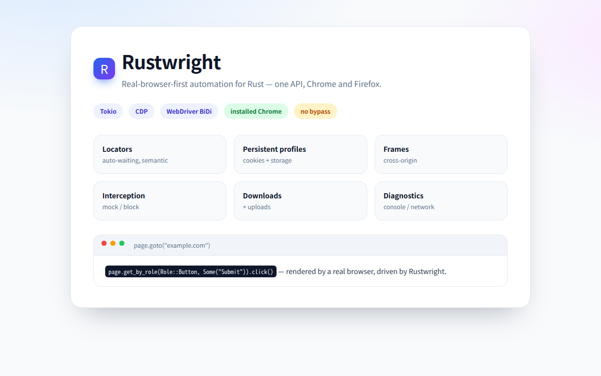
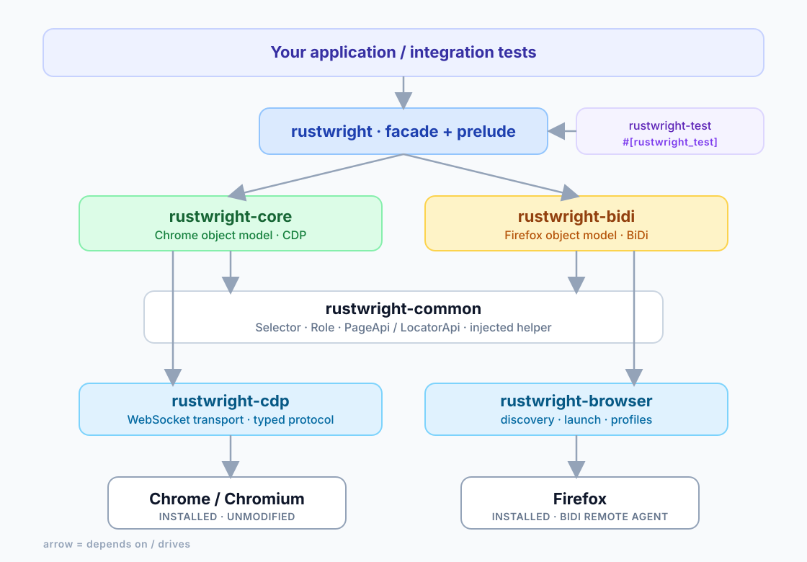
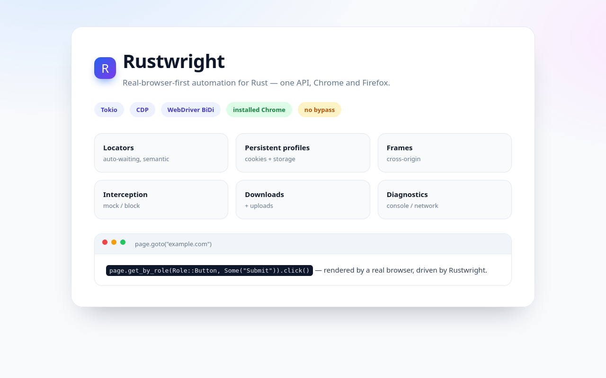
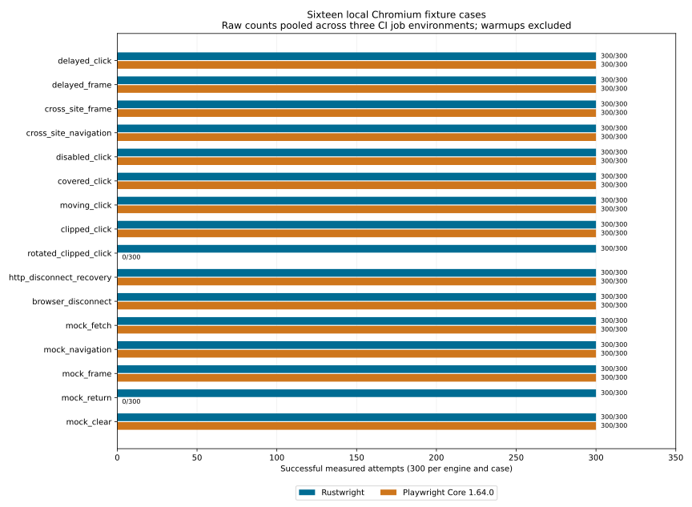

<p align="center">
  
</p>

<p align="center">
  <a href="https://github.com/rsasaki0109/rustwright/releases/tag/v0.1.0"></a>
  <a href="#quick-start"></a>
  
  
  
  
  <a href="https://github.com/rsasaki0109/rustwright/actions/workflows/ci.yml"></a>
</p>

<p align="center">
  <b>Browser automation in Rust, using your installed Chrome or Firefox.</b><br>
  Async pages, locators and browser tests over Chrome CDP and Firefox WebDriver BiDi.
</p>

<p align="center">
  
</p>

Rustwright 0.1.0 provides a shared async API for pages, locators, frames, contexts
and browser tests. It drives installed browsers directly from Rust, with
persistent profiles, protocol input and observable network/console diagnostics.

Get started with [Rust 1.85+ and an installed browser](#quick-start), explore
[the API](#api-sketch), or read the [v0.1.0 release notes](CHANGELOG.md#010--2026-10-10).

```rust
use rustwright::prelude::*;

#[tokio::main]
async fn main() -> Result<()> {
    let browser = Browser::launch(
        Chrome::installed().headless(true)
    ).await?;
    let page = browser.new_page().await?;
    let url = std::env::args().nth(1).unwrap_or_else(|| "https://example.com".into());
    page.goto(&url).await?;
    println!("{}", page.title().await?);
    browser.close().await?;
    Ok(())
}
```

## Contents

- [Why Rustwright](#why-rustwright)
- [Architecture](#architecture)
- [Quick start](#quick-start)
- [API sketch](#api-sketch)
- [One API, two backends](#one-api-two-backends)
- [Firefox and WebDriver BiDi](#firefox-and-webdriver-bidi)
- [Testing](#testing)
- [Verification](#verification)
- [Performance](#performance)
- [Compatibility](#compatibility)
- [Browser discovery](#browser-discovery)
- [Status](#status)
- [Non-goals](#non-goals)
- [Development](#development)

## Why Rustwright

- **Rust-native implementation**, `async`/`await` on Tokio, without a Node runtime
  or a separate WebDriver server.
- **Installed browsers first** — no bundled or patched browser.
- **Persistent profiles** so cookies, `localStorage`, `sessionStorage` and logins
  survive between runs.
- **Connect to a browser you already have open** via `Browser::connect`.
- **Playwright-like `Browser` / `BrowserContext` / `Page` / `Locator` model.**
- **Event-driven waiting** — no fixed sleeps in the public API.
- **Diagnostics** — console messages, JS errors, network requests, dialogs,
  browser version, executable path and launch flags are all observable.

## Architecture

<p align="center">
  
</p>

Selectors, wait states and the page-side helper are shared, with the object model
exposed through `PageApi` / `LocatorApi`. The protocol transports and some
capabilities differ; the compatibility matrix records backend-specific scope.

## Quick start

Rust 1.85 or newer is required, including by the WebSocket transport dependencies.
CI checks the locked workspace and all targets on Rust 1.85.0 as well as stable.

Add the tagged Git release and Tokio to your project. This release is
distributed through GitHub; registry names have historical conflicts, so follow
[the publishing status](docs/PUBLISHING.md) before choosing a crates.io dependency:

```toml
[dependencies]
rustwright = { git = "https://github.com/rsasaki0109/rustwright", tag = "v0.1.0" }
tokio = { version = "1", features = ["full"] }
```

For an adjacent development checkout, use
`rustwright = { path = "../rustwright/crates/rustwright" }` instead. To run the
release examples, clone the tagged source and enter its directory:

```sh
git clone --branch v0.1.0 https://github.com/rsasaki0109/rustwright.git
cd rustwright
cargo run -p rustwright-examples --example quickstart
cargo run -p rustwright-examples --example offline_smoke      # no internet needed
cargo run -p rustwright-examples --example quickstart -- --headless https://example.com
cargo run -p rustwright-examples --example persistent_profile
cargo run -p rustwright-examples --example connect_existing
cargo run -p rustwright-examples --example bidi_firefox       # Firefox / BiDi
cargo run -p rustwright-examples --example extract_items -- \
    "https://jp.mercari.com/search?keyword=iphone" "a[href*='/item/']"
```

`quickstart` and `bidi_firefox` open a visible window by default. On a machine
without a display, pass `--headless`. Both accept `--profile PATH`,
`--screenshot PATH` and a URL; `--help` lists the options. `offline_smoke` starts
its own temporary loopback HTTP fixture, works without internet access and checks
Unicode input, a trusted click and screenshot output. It accepts
`--screenshot PATH` to choose the output file.

`extract_items` is a small *user-code* example: it loads a listing page and
reads titles, prices and links via locators/evaluate. Site-specific logic stays
in your code, never in the core.

## API sketch

```rust
// Launch, headless or headed.
let browser = Browser::launch(Chrome::installed().headless(false)).await?;

// Persistent profile.
let browser = Browser::launch(
    Chrome::installed().profile("./profile").headless(false)
).await?;

// Or attach to a running browser:
//   google-chrome --remote-debugging-port=9222 --user-data-dir=/tmp/live
let browser = Browser::connect("http://127.0.0.1:9222").await?;

// Pages and contexts.
let page = browser.new_page().await?;
let context = browser.new_context().await?;   // isolated cookies/storage

// Navigation.
page.goto("https://example.com").await?;
page.reload().await?;
println!("{}", page.url());
println!("{}", page.title().await?);
let html = page.content().await?;
page.screenshot("page.png").await?;

// Locators (lazy + auto-waiting).
let q = page.locator("input[name=q]");
q.fill("hello").await?;
q.click_with_timeout(Duration::from_secs(2)).await?;
println!("{}", q.text().await?);
println!("{}", q.is_visible().await?);

// Locator collections.
let items = page.locator("li.item");
println!("{}", items.count().await?);
items.first().click().await?;
items.nth(2).hover().await?;
for item in items.all().await? { println!("{}", item.text().await?); }

// Semantic locators.
page.get_by_text("Login").click().await?;
page.get_by_role(Role::Button, Some("Submit")).click().await?;
page.get_by_placeholder("Search").fill("rust").await?;
page.get_by_label("Email").fill("a@b.c").await?;
page.get_by_test_id("submit").click().await?;

// Forms and real input.
page.locator("#agree").check().await?;
page.locator("#plan").select_option("pro").await?;
page.locator("#search").press("Enter").await?;
page.mouse_wheel(400.0, 300.0, 0.0, 800.0).await?; // infinite-scroll feeds

// Waiting.
page.wait_for_load_state(LoadState::DomContentLoaded).await?;
page.wait_for_load_state(LoadState::NetworkIdle).await?;
page.wait_for_url("/dashboard").await?;
page.locator("#result").wait_for(WaitState::Visible).await?;

// Popups / new tabs, and reusable login state.
let popup = browser.default_context().wait_for_page(Duration::from_secs(10)).await?;
let state = page.storage_state().await?;       // cookies + localStorage
page.restore_storage_state(&state).await?;

// Request interception (generic; no site-specific rules).
page.mock("**/api/data", 200, "application/json", r#"{"ok":true}"#).await?;
page.block("**/ads/**").await?;
page.route("**/echo", RouteAction::SetRequestHeaders(vec![("x-app".into(), "1".into())])).await?;
page.route("**/api/**", RouteAction::SetResponseHeaders(vec![("x-served-by".into(), "rustwright".into())])).await?;
page.clear_routes().await?;

// Frames, including cross-origin iframes.
let frame = page.frame_locator("iframe").resolve().await?;
frame.get_by_placeholder("Search").fill("rust").await?;
println!("{}", frame.url());

// Uploads and downloads.
browser.default_context().set_download_path("./downloads").await?;
page.locator("input[type=file]").set_input_files(["./a.pdf"]).await?;

// A stable viewport for deterministic SPA rendering.
page.set_viewport(&Viewport::new(1280, 800)).await?;

// Chrome tracing (JSON with optional screenshots).
page.start_tracing().await?;
// ... exercise the page ...
page.stop_tracing("trace.json").await?;

// Diagnostics.
for message in page.console_messages() { println!("[{}] {}", message.level, message.text); }
for error in page.errors() { println!("error: {}", error.message); }
for dialog in page.dialogs() { println!("dialog: {}", dialog.message); }
let har = page.har_with_bodies().await?;   // HAR 1.2 network log
let diag = browser.diagnostics();
println!("{:?}", diag.launch_args);
```

Chrome contexts discover only their own pages, including when connecting to a
browser with isolated contexts created by another client. The default context
excludes isolated pages. Closed pages are removed when listing tracked pages;
concurrent discovery shares one page session. `wait_for_page` subscribes before
discovery and its timeout covers discovery, attachment and event waiting.
Context closure and browser disconnection wake pending popup waits. Failed,
timed-out or cancelled page initialization detaches its temporary CDP session;
initialization failures remain visible to callers.

Chrome `network_requests()`, `har()` and `har_with_bodies()` include nested and
out-of-process iframe traffic. HAR response bodies come from the session that
observed the request. Entries remain after a frame detaches, but bodies from
detached sessions or evicted by the browser are omitted. CDP request ids can
repeat across sessions; they are not unique keys for the whole page's log.

Chrome navigation waits track each main document's loader id. `goto_with_timeout`
uses one budget for the navigation command and the load wait. Fragment navigation
and same-document history keep their existing load states; `wait_for_url` observes
hash changes and `pushState`/`replaceState`, including a matching URL that changes
again immediately. Reload and history navigation wait for their new commit.
Page closure or browser disconnection ends pending waits with a closed error.
`wait_for_load_state` checks the current document; after a click that navigates,
wait for the destination URL before checking its load state. A timeout or cancelled
future ends the driver wait; the browser may continue loading until another navigation.

Chrome `LoadState::NetworkIdle` waits for 500 ms with no unfinished observed HTTP
requests in the page or its frames, including separate iframe renderers. New
requests restart the quiet window; receiving headers alone does not finish a
request. Streaming HTTP responses remain pending until completion or abort, so a
never-ending response reaches the wait timeout. Frame removal and a new document
clear obsolete pending requests. This condition concerns observed page/frame HTTP
traffic; WebSocket message traffic and independent worker requests are outside it.

Chrome locator clicks wait for visibility, enabled state, two stable animation
frames and a click point that receives pointer events, and recheck after mouse
movement. `click_with_timeout` bounds frame resolution, preparation and dispatch
together; timeouts report the last reason for waiting. Checkbox actions use the
same click checks. Click points come from viewport-clipped content quads, with
verified alternatives when a centre is occluded; the bounded search considers
up to 16 fragments and 256 points. These checks are currently implemented by the
Chrome/CDP locator; the Firefox/BiDi click implementation retains its existing behavior.

Chrome frame locators also operate in cross-site iframes that Chromium isolates
into separate renderer processes. Evaluation and DOM actions use the frame's
own CDP session; clicks account for nested iframe transforms and parent overlays.
Waiting locators re-resolve after reloads and renderer changes, using the same
action deadline. Site isolation remains enabled.

Chrome page routes (`route`, `mock`, `block`, `clear_routes`) also reach existing
and newly attached iframe renderers, including nested frames. HTTP caching is
disabled while routes are active and restored when they are cleared. Active
routes use a CDP debugger gate at document startup to restore interception before
inline scripts run, including when an iframe returns to its parent's renderer.
The driver resumes debugger pauses automatically while routes are active;
clearing routes removes the startup gates and disables its debugger. Started
configuration completes if its caller is cancelled, allowing later cleanup to
remove every gate. See the [renderer-return regression results](bench/reliability/RESULTS.md#renderer-return-route-gate-follow-up-2026-10-08)
for the validated cases. JavaScript `fetch` and XHR remain native.

## One API, two backends

`PageApi` and `LocatorApi` in `rustwright-common` are implemented by both the CDP
backend (`Page` / `Locator`) and the BiDi backend (`BidiPage` / `BidiLocator`), so
generic code runs against either browser:

```rust
use rustwright::prelude::*;

pub async fn fill_and_read<P>(page: &P, url: &str, text: &str) -> std::result::Result<String, P::Error>
where
    P: PageApi,
    P::Locator: LocatorApi<Error = P::Error>,
{
    page.goto(url).await?;
    page.locator(Selector::css("input[name=q]")).fill(text).await?;
    let value = page
        .evaluate("document.querySelector('input[name=q]').value")
        .await?;
    Ok(value.as_str().unwrap_or_default().to_string())
}
```

Pass the URL of a page containing `input[name=q]`; the public example.com page
has no search input. `offline_smoke` demonstrates the same interaction with an
embedded local fixture.

The traits are generic over an associated `Error`, so each backend keeps its own
precise error type and causal chain; dispatch is static (use them as bounds).
`tests/unified.rs` runs the same helpers against Chrome and Firefox.

When a single runtime-selected type is needed, `AnyPage` / `AnyLocator` wrap
either backend in an enum (with a unified `AnyError`) and implement the same
traits, so mixed backends can live in one collection:

```rust
let mut pages: Vec<AnyPage> = Vec::new();
pages.push(browser.new_page().await?.into());          // Chrome
pages.push(bidi_browser.new_page().await?.into());     // Firefox
for page in &pages {
    page.goto("example.com").await?;
    println!("[{}] {}", page.backend_name(), page.title().await?);
}
```

## Firefox and WebDriver BiDi

Chrome is driven over CDP. Firefox is driven over **WebDriver BiDi**, a separate
transport, so it lives in its own crate:

```rust
use rustwright::bidi::BidiBrowser;
use rustwright::prelude::*;

#[tokio::main]
async fn main() -> rustwright::BidiResult<()> {
    let mut firefox = Firefox::installed().headless(true);
    if let Some(profile) = std::env::var_os("RUSTWRIGHT_PROFILE") {
        firefox = firefox.profile(profile);
    }
    let browser = BidiBrowser::launch(firefox).await?;
    let page = browser.new_page().await?;
    let url = std::env::args().nth(1).unwrap_or_else(|| "https://example.com".into());
    page.goto(&url).await?;
    println!("{}", page.title().await?);

    // example.com has a heading; form interaction is shown by offline_smoke.
    println!("{}", page.locator("h1").text().await?);
    page.screenshot("firefox.png").await?;

    browser.close().await?;
    Ok(())
}
```

<p align="center">
  
</p>

`rustwright-bidi` exposes the raw client too (`BidiSession`, typed
`browsingContext.*` / `script.*` helpers, and an event stream), can connect
to any BiDi endpoint with `BidiBrowser::connect`, and provides `BidiLocator`
with auto-waiting `click` / `fill` / `text` / `wait_for` / `count` and the
`get_by_*` strategies. Real pointer and key input uses `input.performActions`,
not synthetic DOM events. BiDi also mirrors the CDP backend's request
interception (`route` / `mock` / `block` / `clear_routes`, backed by
`network.addIntercept` + `network.provideResponse`), opt-in network monitoring
(`start_network_monitoring` / `network_requests`), frames (`frames` /
`frame_locator` / `BidiFrame` with frame-scoped locators), cookies / storage
(`cookies` / `add_cookie` / `clear_cookies` / `storage_state` /
`restore_storage_state`, backed by `storage.*`), request- and response-header
modification (`continueRequest` / `continueResponse`), isolated user contexts
(`BidiBrowser::new_context` / `BidiContext`), and init scripts
(`BidiPage::add_init_script`, backed by `script.addPreloadScript` — the page
helper is installed the same way).

Notes from real machines:

- Firefox's remote agent is started with `--remote-debugging-port`; Rustwright
  picks a free port and connects to `ws://127.0.0.1:PORT/session`.
- Sandboxed Firefox builds (for example the Snap) cannot read arbitrary
  `--profile` paths and cannot navigate to `file://` outside their sandbox.
  `Firefox::installed()` uses the browser's own default profile, which works;
  when a custom profile is requested on a sandboxed build, Rustwright warns and
  falls back to the default profile instead of failing (`Firefox::is_sandboxed`).
- Chrome's native BiDi endpoint (`/session`) returned 404 on the Chrome 150 build
  tested, so Chrome stays on CDP; `BidiBrowser::connect` will use it when a build
  exposes it.
- Network diagnostics are available on both backends: `Page::network_requests`
  (CDP) and `BidiPage::start_network_monitoring` + `BidiPage::network_requests`
  (BiDi).
- Downloads are CDP-only: Firefox 156 has no BiDi download command
  (`browsingContext.setDownloadBehavior` is `unknown command`), so
  `BrowserContext::set_download_path` applies to Chrome.

## Testing

A reproducible [Linux endurance check](bench/endurance/README.md) exercises
1,000 measured context/page cycles per browser after warmup, including cancelled
evaluations, routing changes and iframe renderer swaps. It records driver and browser
memory separately, residual targets/contexts and pending response counts.

`tests/http_compat.rs` runs the same local HTTP scenarios on installed Chrome
and Firefox through `AnyPage` and the frame/context APIs. The verified cases and
remaining gaps are recorded in the [compatibility matrix](docs/COMPATIBILITY_MATRIX.md).
It covers fragment and
history URLs, form values, JavaScript errors, delayed elements, wait deadlines,
cancelled waits, cross-origin frame input, frame reloads, isolated cookies/storage,
popup ownership, page closure and disconnection. Both browsers are required;
missing binaries or startup failures fail this target. CI installs Firefox and
runs browser tests serially:

```sh
cargo test --locked -p rustwright-integration-tests --test http_compat -- --test-threads=1
```

Firefox evaluations return `BidiError::JavaScript` for thrown exceptions and
rejected promises; successful JavaScript `null` and `undefined` map to JSON null.
Frame pointer and keyboard actions use the frame's own browsing context. Locator
wait timeouts in both backends include the protocol response, so an unresolved
page-side promise cannot extend a requested wait. Timing out or cancelling stops
the driver wait; it does not cancel JavaScript already running in the browser.

`rustwright-test` turns an annotated async function into a normal `#[test]`,
with a fresh browser, isolated context and page per test:

Add the runner from the same tagged release alongside the earlier dependencies:

```toml
[dev-dependencies]
rustwright-test = { git = "https://github.com/rsasaki0109/rustwright", tag = "v0.1.0" }
```

```rust
use rustwright_test::prelude::*;

#[rustwright_test]
async fn opens_a_page(context: TestContext) -> Result<()> {
    context.page.goto("example.com").await?;
    assert!(!context.page.title().await?.is_empty());
    Ok(())
}
```

Run with `cargo test`. The same test runs against Chrome by default and against
Firefox with `RUSTWRIGHT_BROWSER=firefox`; `context.page` is an `AnyPage`, so the
body is backend-agnostic. `RUSTWRIGHT_HEADLESS=0` shows the browser,
`RUSTWRIGHT_PROFILE=/path` uses a persistent profile, `RUSTWRIGHT_RETRIES=N`
retries a failing test (with a fresh browser per attempt), and
`RUSTWRIGHT_SHARD=i/N` runs only one shard of the suite. Tests skip cleanly when
automatic discovery finds no selected browser. Explicit `RUSTWRIGHT_CHROME` and
`RUSTWRIGHT_FIREFOX` paths must exist; invalid paths, startup errors and failures
to initialize the browser connection or test context fail the test and follow
the configured retry policy.

`expect(locator)` provides Playwright-style assertions:

```rust
expect(page.locator("h1")).to_have_text("Welcome").await?;
expect(page.get_by_role(Role::Button, Some("Submit"))).to_be_visible().await?;
expect(page.locator("li.item")).to_have_count(3).await?;
```

Matchers retry until the condition matches, with a default timeout of five
seconds. Override the deadline for an assertion target when needed:

```rust
expect(page.locator("li.item"))
    .with_timeout(std::time::Duration::from_secs(2))
    .to_have_count(3)
    .await?;
```

The deadline includes locator reads. An unmet condition panics with the locator,
expected condition, timeout and last observation; transport and JavaScript errors
are returned immediately when observed.

## Verification

The [required seven-job CI](https://github.com/rsasaki0109/rustwright/actions/runs/38005723888)
passed for the release's runtime source. It includes **480 workspace passes**,
formatting, Clippy, Rust 1.85.0, actual package archives and external consumers.
One existing macro doctest is explicitly ignored. The refreshed README and
package documentation are rechecked by the release's main-branch CI.

| Verified scope | Result |
| --- | --- |
| Native Chrome + Firefox, Windows / macOS / Ubuntu | 79 cases passed per OS |
| Additional Ubuntu regressions | 114 passed |
| Linux headed, Chrome 155 / Firefox 157 | 79 passed |
| Linux alternate versions, Chrome 151 / Firefox 153 ESR | 79 passed |
| Package distribution | Eight verified archives; stable + minimum Rust consumers |

The [CI record](docs/CI_VERIFICATION.md) and [compatibility matrix](docs/COMPATIBILITY_MATRIX.md)
identify tested versions, operation outcomes and remaining gaps. Repeated suite
runs are confirmations, not additional unique capabilities.

## Performance

A [repeated matched-browser comparison](bench/reliability/COMPARISON_CI.md) ran
sixteen local Chromium fixture cases, 100 measured attempts per engine/case in
three Ubuntu CI job environments. Both drivers used Chrome for Testing
155.0.8059.39; the reference was Playwright Core 1.64.0 on Node 24.19.0.

| Driver | Measured successes | Failures |
| --- | ---: | ---: |
| Rustwright | **4,800 / 4,800** | 0 |
| Playwright Core 1.64.0 | **4,200 / 4,800** | 600 |

Reference failures occurred in default clicks on rotated/clipped geometry and
mocked fetch/XHR after an iframe returned to the parent renderer. All fourteen
mutually successful cases had lower Rustwright successful p95 in each recorded
job. Default launch and point-selection policies still differ. These local
observations do not establish general SOTA or statistical population estimates.



The Rust driver had lower sampled RSS, while its browser descendants had higher
sampled RSS in this cohort. Live-browser descendant PSS was unavailable. See the
[full report](bench/reliability/COMPARISON_CI.md) for per-job latency, failure strings,
separate memory, source identities, raw observations and measurement limits.
[Benchmark commands](bench/README.md) also retain the earlier microbenchmark
context; those workloads should not be pooled with this comparison.

## Compatibility

Rustwright ships a diagnostics harness for real sites instead of any
site-specific workarounds:

```sh
cargo run -p rustwright-examples --example compat_report
cargo run -p rustwright-examples --example compat_report -- --headed --profile ./target/live
cargo run -p rustwright-examples --example compat_report -- https://example.com
```

It reports the final URL, navigation chain, console/JS errors, failed requests,
non-2xx document responses and a screenshot for each site.

The recorded Linux public-site check completed its operations on example.com,
MDN and docs.rs with both current browsers, retaining six screenshots and
Document HTTP 200 observations. This small selected scope does not predict
arbitrary sites or access-controlled services. For a normal interactive login,
use `browse_session` once and reuse your persistent profile:

```sh
cargo run -p rustwright-examples --example browse_session -- --profile ./target/live https://x.com/
```

## Browser discovery

Rustwright searches platform-specific install locations and `PATH` for Chrome,
Chromium, Edge, Brave and Firefox. You can also pin one explicitly or via the
environment:

```rust
let chrome = Chrome::at("/usr/bin/google-chrome-stable");
let chrome = Chrome::installed().variant(ChromeVariant::Chromium);
// or: RUSTWRIGHT_CHROME=/path/to/chrome
```

## Workspace layout

```
rustwright/
├── crates/
│   ├── rustwright/              # user-facing facade + prelude + AnyPage
│   ├── rustwright-core/         # Browser / BrowserContext / Page / Locator / waits
│   ├── rustwright-common/       # backend-agnostic Selector/WaitState + PageApi
│   ├── rustwright-cdp/          # CDP transport, sessions, typed protocol
│   ├── rustwright-browser/      # Chrome + Firefox discovery, launch, profiles
│   ├── rustwright-bidi/         # WebDriver BiDi client + Firefox driver + locators
│   ├── rustwright-test/         # independent browser test runner
│   └── rustwright-test-macros/  # #[rustwright_test] proc macro
├── examples/                    # runnable examples
├── tests/                       # integration tests against real Chrome/Firefox
└── docs/DESIGN.md               # architecture and design notes
```

## Status

**v0.1.0 is the first GitHub source release.** It includes the shared page and
locator API, Chrome and Firefox transports, browser contexts, network
interception, cross-origin frames and the independent browser test runner.
Downloads and some diagnostics remain backend-specific; the compatibility
matrix documents their scope. APIs may evolve during the 0.x series.

Further reliability milestones, validation limits and the next compatibility
checks are tracked in the [reliability roadmap](docs/RELIABILITY_ROADMAP.md).

Capabilities:

- locator collections (`first` / `last` / `nth` / `all`) and semantic locators
  (`get_by_role` / `get_by_text` / `get_by_placeholder` / `get_by_label` /
  `get_by_alt_text` / `get_by_test_id`),
- forms and real input (`check` / `uncheck` / `select_option` / `press`,
  `mouse_move` / `mouse_click` / `mouse_wheel` / `scroll_by`),
- stable `Viewport` for deterministic rendering,
- auto-dismissed JavaScript dialogs (recorded as diagnostics),
- `wait_for_url`, `go_back` / `go_forward`,
- popups / new tabs via `BrowserContext::wait_for_page`,
- reusable login state via `Page::storage_state` / `restore_storage_state`,
- request interception via `Page::route` / `mock` / `block` / `clear_routes`,
  including request- and response-header modification,
- downloads via `BrowserContext::set_download_path`, uploads via
  `Locator::set_input_files`,
- frames via `Page::frames` / `Page::frame_locator`,
- tracing via `Page::start_tracing` / `stop_tracing`,
- an independent test runner (`rustwright-test`) with `#[rustwright_test]`,
- WebDriver BiDi (`rustwright-bidi`) and a Firefox driver
  (`Firefox` + `BidiBrowser` / `BidiPage`),
- persistent profiles and connect-to-existing-browser.

## Non-goals

Rustwright is deliberately **not** an anti-bot bypass framework. It does not do
CAPTCHA solving, bot-protection bypass, fingerprint spoofing, hiding
`navigator.webdriver`, proxy rotation, rate-limit evasion or site-specific
bypasses. Site-specific behaviour belongs in your code, not in the core.

## Development

The scoped [95% reliability checkpoint](docs/RELIABILITY_95_CHECKPOINT.md) is
complete. Next work includes broader reproducible comparisons and attribution
of remaining browser memory growth; see the [roadmap](docs/RELIABILITY_ROADMAP.md).
Required browser CI and its execution limits are documented in
[CI verification](docs/CI_VERIFICATION.md).

`python3 scripts/release_check.py` verifies the eight distributable archives and
an external version-only consumer on stable and Rust 1.85.0, including all Rust
snippets in this README. Add `--run-browser-tests` with both browser executable
paths configured to exercise the packaged consumer over local HTTP. See
[packaging instructions](docs/PUBLISHING.md) and
[the release verification record](docs/RELEASE_VERIFICATION.md).

```sh
cargo fmt --all
cargo clippy --workspace --all-targets -- -D warnings
cargo test --workspace
```

`unsafe` is forbidden in every crate. Public APIs are documented with rustdoc.

## License

MIT OR Apache-2.0.
