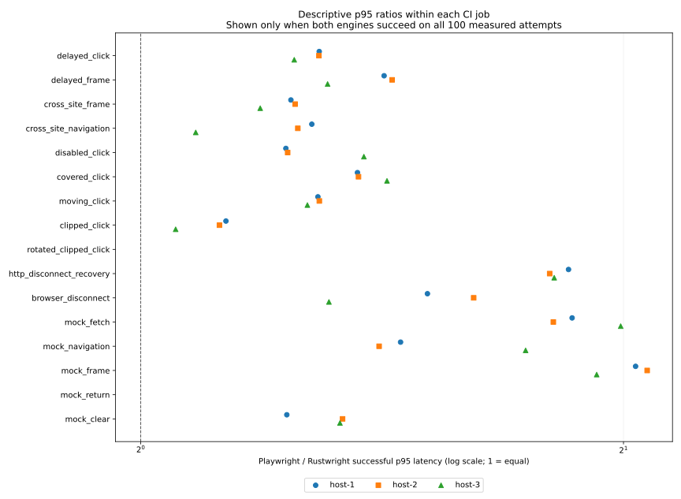

# Repeated Chromium comparison, 2026-10-09–10 UTC

Rustwright completed **4,800/4,800 measured operations** in sixteen local fixture
cases across three Ubuntu CI job environments. Playwright Core 1.64.0 completed
**4,200/4,800**: all measured attempts failed in `rotated_clipped_click` and
`mock_return`, with the other fourteen cases completing in every environment.
These observations establish this fixture result, not general SOTA or a
population reliability estimate.

The [protocol](COMPARISON_PROTOCOL.md) specifies the workload and failure policy.
The [frozen evidence](results/ci-comparison-20261009/README.md) includes original
official ZIPs, job logs, individual reports, raw process sidecars, source archives,
independent audits and a complete checksum manifest. The generated
[per-host report](results/ci-comparison-20261009/attempt-fadb/comparison/artifacts/comparison-summary/REPORT.md)
contains successful median/p95 and separate sampled memory summaries; the
[aggregate JSON](results/ci-comparison-20261009/attempt-fadb/comparison/artifacts/comparison-summary/aggregate.json)
retains all input reports, failure strings and raw failed-attempt elapsed times.

## Conditions and counts

The [comparison run](https://github.com/rsasaki0109/rustwright/actions/runs/38005723883)
completed all three measurement jobs and its validation job successfully.
Each engine measured 100 attempts per case per job, in two passes of 50, ordered
Rustwright → Playwright and then Playwright → Rustwright. One warmup per case,
engine and pass is excluded: Rustwright passed 96/96 warmups; Playwright passed
84/96. There were 9,600 measured observations and 192 warmups in this cohort.

| CI job environment | Rustwright measured success | Playwright measured success |
| --- | ---: | ---: |
| host-1 | 1,600/1,600 | 1,400/1,600 |
| host-2 | 1,600/1,600 | 1,400/1,600 |
| host-3 | 1,600/1,600 | 1,400/1,600 |
| Pooled raw counts | 4,800/4,800 | 4,200/4,800 |

All jobs used Chrome for Testing **155.0.8059.39**, Playwright Core **1.64.0**,
Node **24.19.0** and Rust **1.99.0**. Browser hashes, selected measurement/build
source hashes and tool versions match across jobs. The release Rust binary also
has the same SHA-256 in all three jobs. Both engines use a verified 1280 × 720
viewport, device scale 1, headless mode, disabled GPU and the native sandbox.
Main contexts are reused in both; the disconnect case creates a fresh browser.
Default launch flags, initial pages and debugging port versus pipe still differ.

## Failure observations

In `rotated_clipped_click`, Playwright failed 300/300 measured attempts:
179 exceeded the outer two-second watchdog and 121 reported click timeouts with
`html` intercepting pointer events. Rustwright delivered the required click in
300/300. Both use default click APIs without forced clicks or explicit positions;
their point-selection strategies differ. This compares the observed API outcomes
on this geometry, without isolating one algorithm as the cause.

In `mock_return`, Playwright failed 300/300 measured postconditions: both native
fetch and XHR returned `[200, "network"]` instead of `[201, "mocked"]` after an
out-of-process iframe returned to the parent renderer. Rustwright produced the
required mocked responses in 300/300. Both drivers await route registration and
verify the initially mocked cross-site iframe before starting the timed return.
A read-only source/raw-data review of host-3 found no concrete harness bug;
Playwright's internal cause remains unproven without request-paused tracing.

Remote-frame evidence differs slightly: Node checks a matching iframe-target URL
and the current frame's `localhost` origin; Rust additionally checks the resolved
frame ID against the target ID. The Node evidence establishes a matching remote
target exists, without that additional identity check. Native fetch/XHR and final
response postconditions are checked in both drivers.

## Successful latency

The fourteen cases that completed in both engines had lower Rustwright successful
p95 in each of these three job observations. The following plot shows each job
separately. A ratio is omitted whenever either engine has any measured failure
in that job/case; failed operations are not assigned zero latency.

Setup and initial navigation are outside timed operations. Intentional fixture
delays are included; the two-second watchdog covers the operation and its final
postconditions. Successful median and nearest-rank p95 exclude failures and
warmups; separate all-attempt statistics remain in JSON. Pooled p95 is descriptive
and does not adjust for host effects. Three matrix IDs and UUIDs identify three
job observations, not proof of physically independent machines, statistical
significance or performance on other sites, Firefox, headed mode or other OSes.

## Sampled memory

An external Linux observer samples roughly once per second over launch, setup,
operations and shutdown. Across the six phases per engine, driver maximum sampled
RSS ranges were **7.52–7.91 MiB** for Rustwright and **239.91–264.33 MiB** for
Playwright. Descendant RSS ranges were **3,453.14–3,856.22 MiB** for Rustwright
and **1,735.17–1,756.52 MiB** for Playwright. The lower Rust driver footprint
therefore does not establish a smaller complete browser footprint.

Descendant PSS was unavailable in 1,093/1,099 Rustwright samples and
2,025/2,031 Playwright samples. Each phase has one readable zero-descendant
sample; those zeros do not measure a live browser's PSS. Raw nulls and missing
counts are retained. RSS double-counts shared mappings; per-field maxima are
not simultaneous or exact peaks, descendants include helpers, and failure waits
make phase durations unequal. These are not steady-state leak measurements.
The larger Rust descendant RSS warrants separate attribution before any overall
memory-advantage claim.

## Repairs and fresh regression validation

The first measured source, `d563c828`, exposed two CI failures: cached result
directories prevented the extended native suite from starting, and Windows
Firefox failed to create its first foreground page. Its three comparison jobs
also failed during Playwright command-line diagnostics before any reference
observations. The original 2,400 successful Rustwright measured attempts and
48 warmups are preserved as an incomplete cohort and are excluded above.

Results now use fresh directories outside Cargo caches. Playwright diagnostics
inspect the actual browser PID, executable and command line without adding
`--enable-automation`. Firefox allocates a background tab first, then explicitly
activates its acknowledged ID; the creation guard closes allocated tabs on
activation failure or cancellation. No retry, extra sleep or suppressed error
was added. Activation is distinct from Firefox's full foreground-create
visibility-wait sequence; unrelated activation failures can still occur.

The [fresh required CI](https://github.com/rsasaki0109/rustwright/actions/runs/38005723888)
passed all seven jobs, including **480 workspace tests**, five added creation
regressions, formatting, Clippy, Rust 1.85.0 and verified package consumers.
One pre-existing macro doctest remains explicitly ignored. The portable native
suite passed 79 cases on each of Windows, macOS and Ubuntu, plus 114 Ubuntu-only
cases. Linux headed and alternate-version runs passed another 79 cases each.
Five fresh Firefox startup/visible-page/close cycles completed in each of those
five native suite commands. Package, public-site, screenshot and mapped-window
proofs remain scoped to their recorded commands.

The tested branch source is `fadb3463297fb611915cc8fc92a4b1a91f196f15`; actual
CI checkout is PR merge `87f6180e4922ca860e10f91701e6032e6cb85390`. All 3,641
regular Git blobs and modes match between them, and all measurement reports
declare those same file hashes with clean Git status. Later reporting edits are
documentation/evidence changes; they are not relabeled as the tested commit.
Source archives preserve the tested README and reproducible build inputs.

Two earlier queued comparisons were cancelled before measurement after setup
corrections; their snapshots are retained. All started measurements and setup
failures remain in the evidence. There was no selective case rerun or deletion
of failed observations from this completed cohort.
